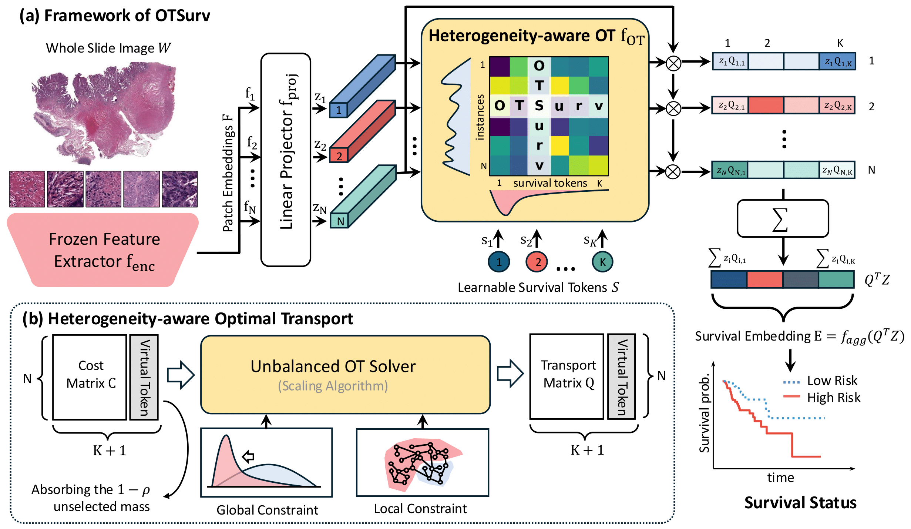
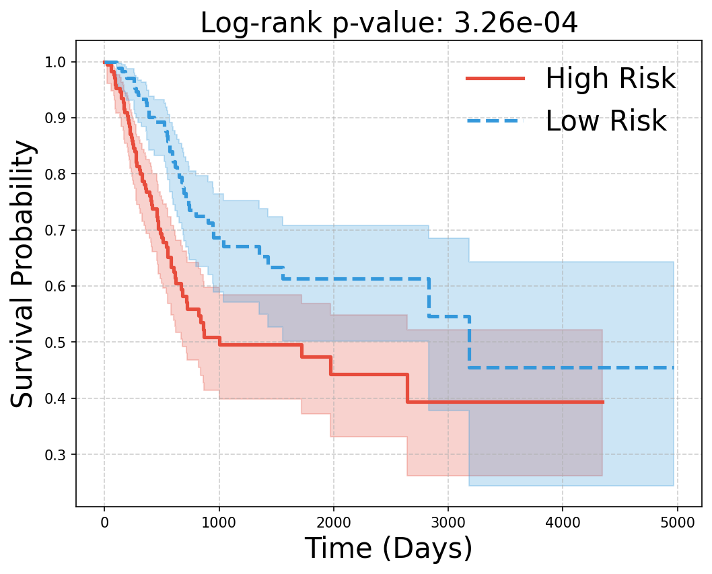

<div align="center">
  
  

  <h2>OTSurv: A Novel Multiple Instance Learning Framework for Survival Prediction with Heterogeneity-aware Optimal Transport</h2>
  <h4>🌟 MICCAI 2025 🌟</h4>
  
  <br>
  
  <p>
    <a href="https://scholar.google.com.hk/citations?user=Tcg-9DcAAAAJ">Qin Ren</a><sup>1 ★</sup>&nbsp;
    <a href="https://yfwang.me/">Yifan Wang</a><sup>1</sup>&nbsp;
    <a href="https://lab-smile.github.io/">Ruogu Fang</a><sup>2</sup>&nbsp;
    <a href="https://scholar.google.com/citations?hl=en&user=v3w4IYUAAAAJ">Haibin Ling</a><sup>1</sup>&nbsp;
    <a href="https://chenyuyou.me/">Chenyu You</a><sup>1 ★</sup>
  </p>

  <p>
    <sup>1</sup> Stony Brook University &nbsp;&nbsp; 
    <sup>2</sup> University of Florida &nbsp;&nbsp; <br>
    ★ Corresponding authors
  </p>

<div align='center'>

<p>
  <a href="https://arxiv.org/abs/2506.20741">
    
  </a>
  
</p>

</div>

</div>


## 🧠 DL;TR

  <p>
    Welcome to the official repository of <b>OTSurv</b>, a novel framework that integrates 
    <b>Multiple Instance Learning (MIL)</b> with <b>Heterogeneity-aware Optimal Transport (OT)</b> 
    to tackle the challenges of survival prediction in medical imaging and clinical data.
  </p>

  <blockquote>
    📍 <b>To be presented at MICCAI 2025</b><br>
    🧠 <b>Focus</b>: Survival Analysis · Multiple Instance Learning · Optimal Transport
  </blockquote>

<div align="center">
  
</div>

## 📁 Data Organization

### Project Structure
```
OTSurv/
├── checkpoints/
│   ├── model_blca_fold0.pth
│   ├── model_blca_fold1.pth
│   └── ...
│ 
├── data/
│   ├── tcga_blca/
│   ├── tcga_brca/
│   ├── tcga_coadread/
│   ├── tcga_kirc/
│   ├── tcga_luad/
│   └── tcga_stad/
│ 
├── result/
│   ├── exp_otsurv_test/
│   ├── exp_otsurv_train/
│   └── visualization/
│
├── src/
│   ├── scripts/
│   ├── analysis/
│   └── ...
│
└── docs/
│   ├── OTSurv_main.png
│   └── OTSurv_heatmap.png
```

### Feature Format
- **H5 Format**: Features are stored in `.h5` files (directories ending with `feats_h5/`)

For patch feature extraction, please refer to [CLAM](https://github.com/mahmoodlab/CLAM).

You can download the preprocessed features from [this link](#) (link to be provided).

<br>

## 🚀 Quick Start

### Prerequisites

- Python 3.8+
- GPU or CPU-only
- Conda package manager

### Installation

```bash
# Clone the repository
git clone https://github.com/Y-Research-SBU/OTSurv.git
cd OTSurv

# Create conda environment
conda env create -f env.yaml
conda activate otsurv
```

### Training

```bash
# Training results will be saved under result/exp_otsurv_train

cd src
# Train on all datasets
bash scripts/train_otsurv.sh

# Train on TCGA-BLCA dataset specifically
bash scripts/train_blca.sh
```

### Evaluation

You can download pre-trained checkpoints from [this link](#) (link to be provided).

```bash
# Test results will be saved under result/exp_otsurv_test

cd src
# Test on all datasets
bash scripts/test_otsurv.sh

# Test on TCGA-BLCA dataset specifically
bash scripts/test_blca.sh
```

```bash
cd src
# Calculate performance metrics
python analysis/calculate_CIndex_mean_std.py
```

```bash
# Generated figures will be saved under result/visualization

cd src
# Generate survival curves
python analysis/plot_survival_curv.py
```

The survival curve for TCGA-BLCA looks like this:
<div align="center">
  
</div>

<br>

## 📊 Performance Results

Below are the C-Index performance results of OTSurv across different cancer types:

| Cancer Type | Mean C-Index | Std Dev |
|-------------|-------------|---------|
| **BRCA**  | 0.621 | ±0.071 |
| **BLCA**  | 0.637 | ±0.065 |
| **LUAD**  | 0.638 | ±0.077 |
| **STAD**  | 0.565 | ±0.057 |
| **COADREAD** | 0.667 | ±0.111 |
| **KIRC**  | 0.750 | ±0.149 |

**Overall Performance**: Average C-Index across all datasets is **0.646**

> 💡 **Note**: C-Index (Concordance Index) is a commonly used performance metric in survival analysis, where values closer to 1.0 indicate better prediction performance.

<br>

## 📚 Citation

If you find this work useful, please cite our paper:

```bibtex
@inproceedings{ren2025otsurv,
  title={A Novel Multiple Instance Learning Framework for Survival Prediction with Heterogeneity-aware Optimal Transport},
  author={Ren, Qin and Wang, Yifan and Fang, Ruogu and Ling, Haibin and You, Chenyu},
  booktitle={Medical Image Computing and Computer Assisted Intervention (MICCAI)},
  year={2025},
  note={Accepted for publication}
}
```

> 📝 **Note**: This paper has been accepted at MICCAI 2025. The citation details will be updated once the paper is officially published.
> 

<br>

## 🙏 Acknowledgements

This work builds upon the excellent research from:
- [PANTHER](https://openaccess.thecvf.com/content/CVPR2024/html/Song_Morphological_Prototyping_for_Unsupervised_Slide_Representation_Learning_in_Computational_Pathology_CVPR_2024_paper.html)
- [MMP](https://github.com/mahmoodlab/MMP) 
- [CLAM](https://github.com/mahmoodlab/CLAM)
- [PPOT](https://github.com/rhfeiyang/PPOT) 

<br>

## 📄 License

This project is licensed under the Creative Commons Attribution-NonCommercial-ShareAlike 4.0 International License - see the [LICENSE.md](LICENSE.md) file for details.

<br>

## 🤝 Contributing

We welcome contributions to **OTSurv**! If you have suggestions, bug reports, or want to add features or experiments, feel free to:

- 🐞 Submit an issue
- 🔧 Open a pull request
- 💬 Start a discussion

---

<p align="center">
  ⭐ <strong>If you find this repository helpful, please consider starring it!</strong> ⭐
</p>
